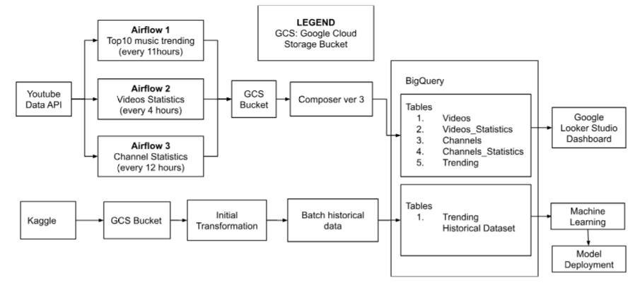

# IS3107 Project Group 19

## Group Members
- Jeff Khong Jie Hui
- Woon Cher Han
- Wu Tong
- Yee Kai Yang, Cedric 

## Project Description
Our project aims to provide accessible and versatile video analytics that combine real-time trend analysis with predictive modelling to help content creators, marketers, and media analysts make data-driven decisions in YouTube's highly competitive landscape, where over 500,000 hours of content are uploaded every minute (SEO.AI, 2025). By developing an integrated analytics pipeline that utilizes both streaming data from the YouTube API and historical datasets from Kaggle, we aim to provide access to actionable insights by building a comprehensive dashboard with dynamic visualisations of trending videos and channels and developing machine learning (ML) models that predict YouTube video popularity scores based on various features such as video category, title and description. 

The dashboard will serve as an intuitive interface where users can monitor real-time trends, identify successful content themes, and assess channel growth. It will facilitate decision-making by allowing content creators to conduct market research: they can analyse trending tags, learn which types of titles and descriptions gain more views and engagement, and adapt their content strategy accordingly. 

The ML models complement this by predicting the likelihood of a video’s success before it is even published. By using historical data to train models on patterns and features that correlate with past performance, content creators can obtain predictive insights into how their upcoming videos might perform. This holistic approach of combining real-time data visualisation and ML predictions will enable creators to make data-informed decisions, optimise their content, ultimately increasing audience engagement and growth.

## Tech Stack
(Pipeline + Model Deployment)
- Apache Airflow
- Google Cloud Services (GCS)
- Google BigQuery 
- Streamlit

(Dashboard)
- Google Looker Studio 

(Machine Learning)
- Scikit-Learn
- Tensorflow
- Keras Tuner 

## Repository Structure

```plaintext 
IS3107_Project/
|
├── API Streaming/
|   ├── Airflow/     # Airflow DAGs
|   |   ├── ER2_trending_daily_google_bq.py
|   |   ├── ER2_youtube_channel_videos_google_bq.py
|   |   ├── ER2_youtube_channels_google_bq.py
|   |
|   ├── creating_tablesBigQuery_youtube_api.ipynb     # Creating BigQuery Tables for Streaming Data
|
├── Assets/
|   ├── Data_Pipeline.png
|   ├── ELTL_Historical.png
|   ├── ER_Diagram_Airflow.png
|   ├── ML_Model_Deployment.png
|
├── Historical Data/
|   ├── kaggle_data/     # US Historical YouTube Trending Videos Dataset
|   |   ├── US_category_id.json
|   |   ├── US_youtube_trending_data.csv
|   |
|   ├── models/
|   |   ├── keras_tuner_dir/     # Keras Tuner outputs for Hyperparameter Tuning
|   |   ├── train_test_data/     # ML Train, test parquet files
|   |   |   ├── test_dataset.parquet
|   |   |   ├── train_dataset.parquet
|   |   |
|   |   ├── trained_models/     # Trained Neural Network Tuned ML model + Preprocessing Tools
|   |   |   ├── Historical_TrainedModels_LoadGCS.ipynb     # Load model + preprocesing tools to GCS
|   |   |   ├── ohe.pkl
|   |   |   ├── scaler.pkl
|   |   |   ├── tdidf.pkl
|   |   |   ├── tuned_NN_model.h5
|   |   |
|   |   ├── app.py     # Streamlit Web UI for Deployed Neural Network ML Model (from GCS)
|   |   ├── Historical_ML_SVC_RF_XGBoost.ipynb
|   |   ├── Hisotrical_ML_NN.ipynb
|   |   
|   ├── Historical_ML_EDA.ipynb     # EDA for US Historical YouTube Trending Videos Dataset
|   ├── Historical_TransformLoad_BigQuery.ipynb     # Transform data and Load into BigQuery
|   ├── Historical_YoutubeTrending.ipynb     # Load CSV Kaggle file into GCS
|   ├── US_youtube_trending_data.parquet
|   ├── youtube_113_countries.ipynb     # 113 countries YouTube Trending Videos Dataset
|
├── .gitattributes
├── .gitignore
├── README.md
```

## Data Pipeline Overview


### ER Diagram for Airflow


### ELTL Pipeline (Historical Trending Data)


## Model Deployment (Machine Learning)

